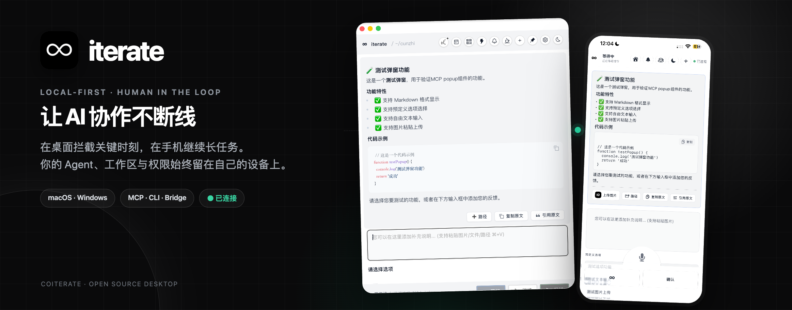
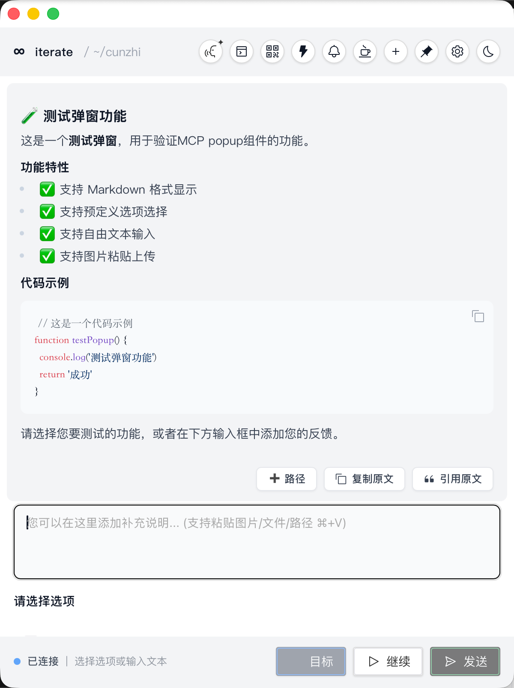
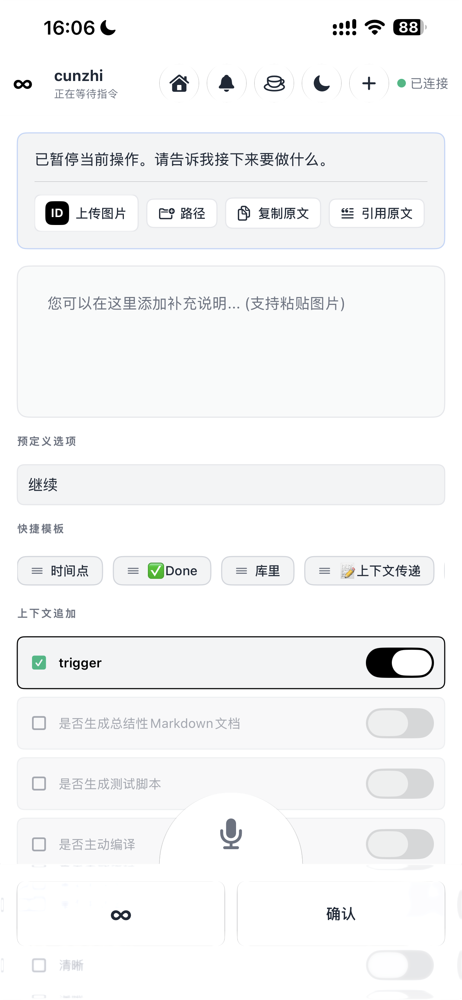
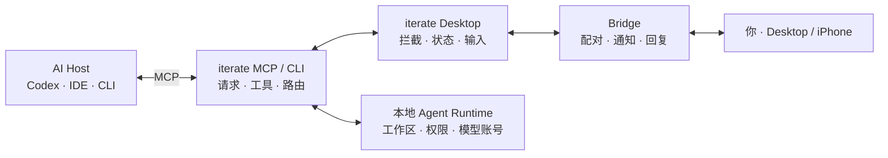

<p align="center">
  <a href="https://iterate.xin/"></a>
</p>

<h1 align="center">iterate</h1>

<p align="center">
  <strong>让 AI 协作不断线。</strong><br>
  在桌面拦截关键时刻，在手机继续长任务；Agent、工作区与权限始终留在自己的设备上。
</p>

<h3 align="center">
  <a href="https://github.com/kexin94yyds/iterate-releases/releases/latest">下载最新版</a>
  · <a href="#文档">查看文档</a>
  · <a href="CONTRIBUTING.md">参与共创</a>
</h3>

<p align="center"><sub>
  由 <a href="https://github.com/co-iterate">coiterate</a> 共同维护的本地优先开源桌面项目。<br>
  本仓库公开 iterate Desktop、MCP/CLI、Bridge 协议与本地配对兼容层；官方移动客户端与托管服务单独分发。
</sub></p>

<p align="center">
  
  <a href="https://github.com/kexin94yyds/iterate-releases/releases/latest"></a>
  <a href="https://github.com/kexin94yyds/iterate-releases/releases"></a>
  <a href="https://github.com/co-iterate/iterate-desktop"></a>
  <a href="LICENSE"></a>
  
</p>

<p align="center">
  
  &nbsp;&nbsp;
  
</p>

iterate 连接正在运行的 AI 编程工具，在它准备过早结束、等待确认或需要人工方向时，把控制权交还给你。你可以在桌面继续，也可以通过自己的 iPhone 回到同一条任务链路，而不是重新解释上下文、重新启动任务。

## 下载与安装

正式安装包通过独立的 [iterate Releases](https://github.com/kexin94yyds/iterate-releases/releases) 仓库发布。

| 平台 | 获取方式 | 说明 |
| --- | --- | --- |
| macOS | [下载最新版本](https://github.com/kexin94yyds/iterate-releases/releases/latest) | 打开 DMG，将 `iterate.app` 放入“应用程序” |
| Windows | [下载最新版本](https://github.com/kexin94yyds/iterate-releases/releases/latest) | 解压 `iterate-windows-x64.zip`，运行 `Install iterate.bat` |
| 从源码构建 | [构建文档](BUILDING.md) | Node.js、pnpm、Rust 与 Tauri 2 |

安装后还要把 MCP command 配进当前 AI 客户端：

- macOS：`/Applications/iterate.app/Contents/MacOS/mcp-server`
- Windows：`%LOCALAPPDATA%\iterate\bin\mcp-server.exe`（写入配置时使用当前用户的绝对路径）

完全重启 Windsurf、Cursor、Codex 或其他客户端后，由客户端自动启动 MCP server；普通用户不需要在终端长期手动运行它。随后打开 App 内“使用说明书”，复制不依赖个人知识库的“通用系统提示词”，并发起一次带非空 `message` 的 `zhi` / `call_zhi` 完成验证。

完整的 macOS / Windows 安装、MCP 接入和验证流程见 [安装与使用说明](docs/INSTALLATION.md)，常见故障见 [TROUBLESHOOTING.md](TROUBLESHOOTING.md)。

## 为什么需要 iterate

<table>
  <tr>
    <td width="50%" valign="top">
      <h3>把“结束”变成一次确认</h3>
      <p>当 AI 准备收尾时，iterate 显示当前请求、预定义选项和补充输入，让你决定继续、调整方向或真正结束。</p>
    </td>
    <td width="50%" valign="top">
      <h3>桌面与手机接力</h3>
      <p>桌面端生成短时配对信息，iPhone 连接你自己的 Mac。任务仍在原设备运行，手机只负责查看、通知和回复。</p>
    </td>
  </tr>
  <tr>
    <td width="50%" valign="top">
      <h3>本地优先，而不是托管你的代码</h3>
      <p>工作区、Agent Runtime、模型登录态和执行权限留在本机。Bridge 负责把同一任务的控制信号送到正确的会话。</p>
    </td>
    <td width="50%" valign="top">
      <h3>不只是一只弹窗</h3>
      <p>多会话管理、历史与状态、Markdown、多模态输入、语音、CLI、IDE 与跨平台兼容层共同组成可持续的人工接管工作流。</p>
    </td>
  </tr>
</table>

## 当前能力

| 能力 | 状态 | 说明 |
| --- | --- | --- |
| Desktop 拦截与任务管理 | ✅ | Tauri 2 + Vue 3，支持 macOS 与 Windows |
| MCP / CLI | ✅ | `iterate` 与 `mcp-server` 提供本地服务、工具与桥接能力 |
| 多会话与历史状态 | ✅ | 管理并恢复并行 AI 任务，保留明确的任务路由 |
| 多模态与语音 | ✅ | 支持文本、图片、文件、路径、Markdown 与本地语音链路 |
| iPhone 远程继续 | ✅ 独立分发 | 本仓库公开配对/Bridge 协议与兼容层；官方 iOS 客户端源码不在本仓库 |
| Android 远程继续 | 设计中 | 已建立 [Android v0 设计与实现路线](https://github.com/co-iterate/iterate-desktop/issues/22)；目前尚无可下载 APK |
| IDE / 浏览器扩展 | 独立分发 | 官方扩展属于 iterate 生态，但不包含在本 desktop-source 仓库 |

## 开源范围与产品边界

这个仓库公开的是 **iterate Desktop**：桌面 UI、MCP/CLI、Bridge 协议、本地配对兼容层，以及构建、测试和发布门禁。

以下组件属于 iterate 产品生态，但不包含在本仓库，也不受本仓库 MIT 许可证覆盖：

- iOS、Android 与其他官方移动客户端；
- 浏览器扩展、VS Code / Windsurf 扩展；
- 托管服务、生产运维配置、支付与发布凭据。

社区构建默认不需要激活码。桌面核心、Bridge 与二维码配对可以独立构建和运行；涉及官方客户端或托管服务的能力会在文档中明确标注。

## 文档

### 用户文档

| 目标 | 入口 |
| --- | --- |
| 安装和首次接入 | [安装指南](docs/INSTALLATION.md) |
| 排查常见问题 | [TROUBLESHOOTING.md](TROUBLESHOOTING.md) |
| 了解隐私边界 | [PRIVACY.md](PRIVACY.md) |
| 获取支持 | [SUPPORT.md](SUPPORT.md) |

### 开发者与维护者文档

| 目标 | 入口 |
| --- | --- |
| 从源码构建 | [BUILDING.md](BUILDING.md) |
| 理解六层架构 | [iterate 六层架构](docs/iterate_6_Layers_Architecture.md) |
| 理解 MCP 工具流 | [MCP 核心流程](docs/MCP核心流程详解.md) |
| 阅读对话历史设计 | [conversation-history-design.md](docs/conversation-history-design.md) |
| 阅读 Loop 合同 | [loop-contract-v0.md](docs/loop-contract-v0.md) |
| 安全报告与边界 | [SECURITY.md](SECURITY.md) |
| 参与贡献 | [CONTRIBUTING.md](CONTRIBUTING.md) |

## 架构



更详细的模块与数据流见 [架构文档](docs/iterate_6_Layers_Architecture.md) 和 [MCP 核心流程](docs/MCP核心流程详解.md)。

## 本地开发

```bash
git clone https://github.com/co-iterate/iterate-desktop.git
cd iterate-desktop
pnpm install
pnpm tauri:dev
```

常用验证：

```bash
pnpm lint
pnpm test:scripts
pnpm test:frontend
cargo test
```

完整环境要求、平台依赖与打包流程见 [BUILDING.md](BUILDING.md)。

## 参与共创

我们欢迎错误修复、测试、文档、跨平台适配、交互改进和新工具提案。请先阅读 [CONTRIBUTING.md](CONTRIBUTING.md)，所有改动通过分支与 Pull Request 提交。

`main` 已启用保护：

- 至少 1 次批准后才能合并；
- 新提交会使旧批准失效；
- Review 对话必须解决；
- 禁止强推与删除主分支。

coiterate 的协作团队：

| Team | 职责 | 仓库权限 |
| --- | --- | --- |
| [`contributors`](https://github.com/orgs/co-iterate/teams/contributors) | 通过 PR 共创功能、测试与文档 | Write |
| [`maintainers`](https://github.com/orgs/co-iterate/teams/maintainers) | 模块维护、Review 与质量边界 | Maintain |
| [`release`](https://github.com/orgs/co-iterate/teams/release) | 可验证打包与发布流程 | Maintain |

开始参与：

1. 在 [Issues](https://github.com/co-iterate/iterate-desktop/issues) 中描述问题或提案；
2. 从小而完整的任务开始，并在实现前确认边界；
3. 提交包含验证证据的 PR；
4. 完成持续贡献与互相 Review 后，再承担稳定的模块维护职责。

## 社区交流

欢迎加入 iterate 交流群，讨论使用问题、产品建议、开发协作和项目进展。

<table>
  <thead>
    <tr>
      <th align="center">微信群</th>
      <th align="center">QQ群</th>
    </tr>
  </thead>
  <tbody>
    <tr>
      <td align="center"></td>
      <td align="center"></td>
    </tr>
    <tr>
      <td align="center"><sub>有效期至 2026-09-04；失效后请先加入 QQ 群联系管理员</sub></td>
      <td align="center"><sub>群号：186107551</sub></td>
    </tr>
  </tbody>
</table>

- [GitHub Issues](https://github.com/co-iterate/iterate-desktop/issues)：Bug、需求与设计讨论
- [GitHub Pull Requests](https://github.com/co-iterate/iterate-desktop/pulls)：实现、Review 与验证证据
- [iterate 官网](https://iterate.xin/)：产品、下载与公开合规信息

## 特别感谢

感谢 [cunzhi](https://github.com/imhuso/cunzhi) 的原始开源工作，以及 [acemcp](https://github.com/qy527145/acemcp) 提供的语义搜索能力。也感谢每一位使用、反馈、测试与参与共创的人。

## License

本项目遵循 [MIT License](LICENSE)。上游版权与第三方声明见 [NOTICE](NOTICE)、[LICENSE-UPSTREAM](LICENSE-UPSTREAM) 与 [THIRD_PARTY_NOTICES.md](THIRD_PARTY_NOTICES.md)。
