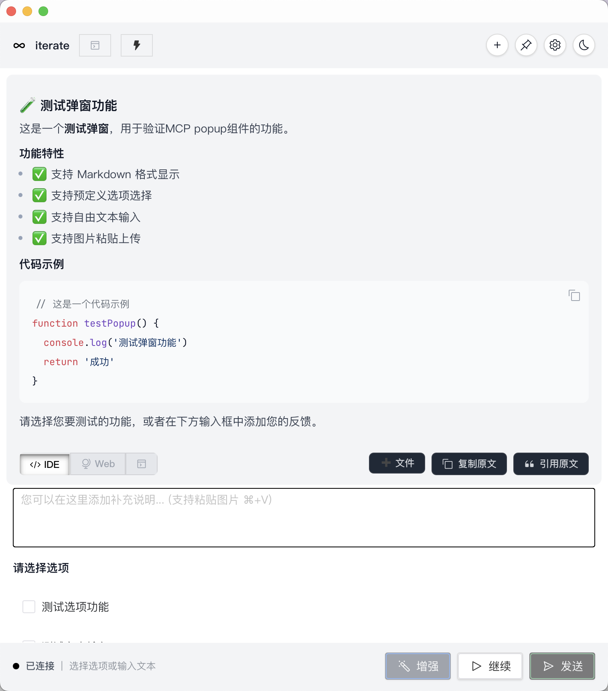
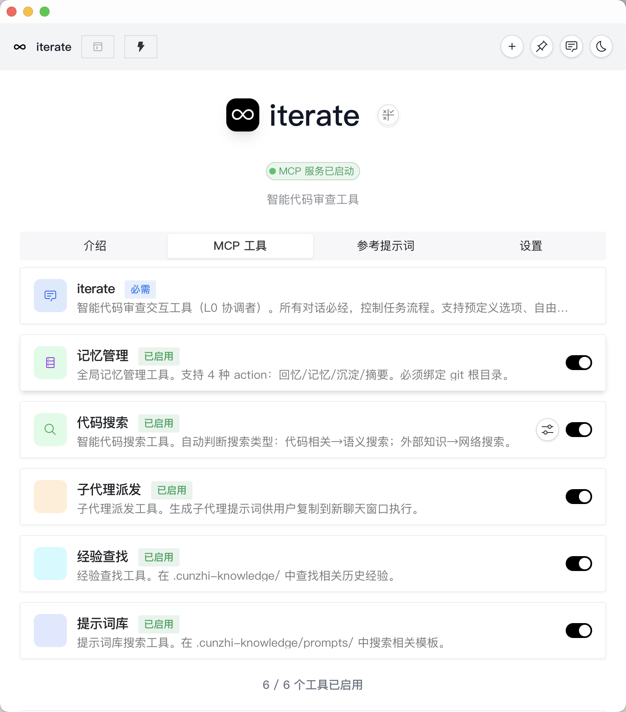

<p align="center">
  
</p>

<p align="center">
  <a href="https://github.com/kexin94yyds/iterate-desktop/stargazers">
    
  </a>
  <a href="https://github.com/kexin94yyds/iterate-desktop/blob/main/LICENSE">
    
  </a>
  <a href="https://github.com/kexin94yyds/iterate-releases/releases">
    
  </a>
  <a href="https://github.com/kexin94yyds/iterate-releases/releases">
    
  </a>
</p>

# iterate 🔄
**让 AI 协作不断线**

还在为 AI 助手总是提前结束对话而抓狂吗？**iterate** 专为终结 AI 的“草草了事”而生。它不仅是一个智能拦截器，更是一个兼容 Web、CLI、IDE、Mobile 的多端异步任务管理框架。

---

## 🔓 公开源码范围

这个仓库公开的是 **iterate Desktop**：Tauri 桌面端、MCP/CLI、Bridge 协议与本地配对兼容层。

以下组件属于官方生态，但不包含在本仓库，也不受本仓库 MIT 许可证覆盖：

- iOS、Android 与其他官方移动客户端；
- 浏览器扩展、VS Code / Windsurf 扩展；
- 托管服务、生产运维配置、支付与发布凭据。

桌面端可以在没有这些闭源组件的情况下独立构建和运行。涉及官方客户端或托管服务的功能会在文档中明确标注。

---

## 📸 核心预览

### 1. 智能拦截
当 AI 想要结束对话时，拦截窗口会自动弹出，让您完全掌控对话节奏，实现“无限对话”。


---

### 2. 官方多端生态与跨端体验

iterate 也提供独立分发的官方多端客户端与扩展。下面展示的是完整产品生态，并不表示相关源码都位于本仓库。

#### 📱 移动端与 Web 管理
适配移动设备与主流浏览器，支持随时随地查看任务状态、管理配置。


#### 💻 VSCode / Windsurf 扩展（单独分发）
官方扩展提供 IDE 侧边栏与服务生命周期管理，但扩展源码不包含在本 desktop-source 仓库。

#### 🔗 iOS Bridge（公开协议，官方客户端单独分发）
本仓库保留 Bridge 协议、配对和兼容层；官方 iOS 客户端及其源码不包含在本仓库。

---

### 3. 任务历史与状态跟踪

实时记录 AI 的每一个思考步骤与任务摘要，确保复杂长任务的透明度。


---

## ✨ 核心特性

- **多端异步并发**：原生支持多个 AI 会话并行，任务进程独立管理。
- **智能拦截**：AI 准备收尾时自动触发 GUI/CLI 确认。
- **Skill 自动恢复**：端口占用或服务未启动时智能自愈。
- **全功能交互**：支持 Markdown 渲染、快捷键增强、多模态输入。

---

## 🚀 快速开始

### 第一步：下载安装包

访问 [Releases](https://github.com/kexin94yyds/iterate-releases/releases) 下载对应系统的安装包。

### 第二步：安装 iterate

- **macOS / Linux**：解压后运行 `./install.sh`，按提示选择要接入的客户端。
- **Windows**：解压后查看包内 `INSTALLATION.md`，按说明完成安装和客户端接入。

### 第三步：接入客户端

当前说明文档支持以下客户端：

- Windsurf
- Cursor
- Codex CLI
- 其他客户端（按文档中的 AI 提示词辅助排障）

### 第四步：验证

安装完成后，重启你的客户端，并确认 iterate 已完成接入。

如果安装卡住，直接使用包内 `INSTALLATION.md` 里的完整 AI 提示词，让 AI 继续帮你完成安装、MCP 配置和验证。

---

## 🏗️ 系统架构

```
┌─────────────────────────────────────────────────────────────┐
│                      iterate 生态系统                        │
├─────────────────────────────────────────────────────────────┤
│                                                             │
│  ┌─────────────────┐    ┌─────────────────┐    ┌──────────┐ │
│  │  VSCode 插件    │    │  iterate.app    │    │  iOS     │ │
│  │  (IDE 端)       │    │  (Web/Tauri)    │    │  Bridge  │ │
│  └────────┬────────┘    └────────┬────────┘    └─────┬────┘ │
│           │                      │                    │     │
│           │ 启动 / 通信           │ 提供                │ 桥接  │
│           ▼                      ▼                    ▼     │
│  ┌──────────────────────────────────────────────────┐      │
│  │        iterate --serve (HTTP 核心服务)           │      │
│  │        监听端口: 5310+ (自动分配/健康检查)         │      │
│  └────────────────────┬────────────────────┘               │
│                       │                                     │
│                       │ 异步请求 / 文件交换                 │
│                       ▼                                     │
│  ┌──────────────────────────────────────────────────┐      │
│  │   iterate --bridge (AI 交互桥接，内置于 binary)   │      │
│  │   实现任务状态同步与用户反馈拦截                 │      │
│  └──────────────────────────────────────────────────┘      │
│                                                             │
└─────────────────────────────────────────────────────────────┘
```

---

---

## ⌨️ 常用快捷键

| 快捷键 | 功能 | 说明 |
| :--- | :--- | :--- |
| **⌘ + Enter** | 快速发送 | 提交当前输入并继续 |
| **⌥ + Enter** | 继续对话 | 让 AI 继续执行当前逻辑 |
| **Tab** | 下一个选项 | 快速切换预定义反馈选项 |
| **Esc** | 关闭弹窗 | 最小化或关闭当前拦截窗口 |

---

## 🛠️ 本地开发

```bash
git clone https://github.com/kexin94yyds/iterate-desktop.git
cd iterate-desktop
pnpm install
pnpm tauri:dev
```

---

## 🤝 参与贡献

我们欢迎所有形式的贡献！
感谢 [acemcp](https://github.com/qy527145/acemcp) 提供的语义搜索能力。

---

## 📄 开源协议

MIT License
