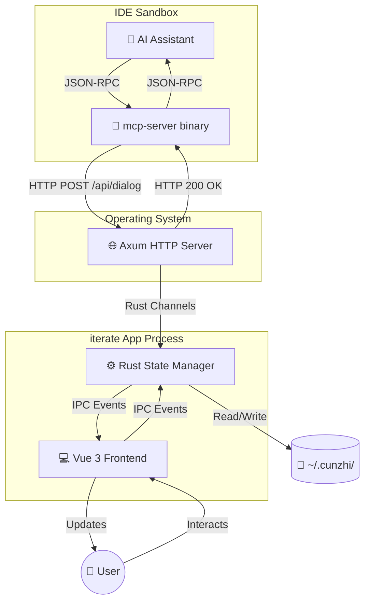
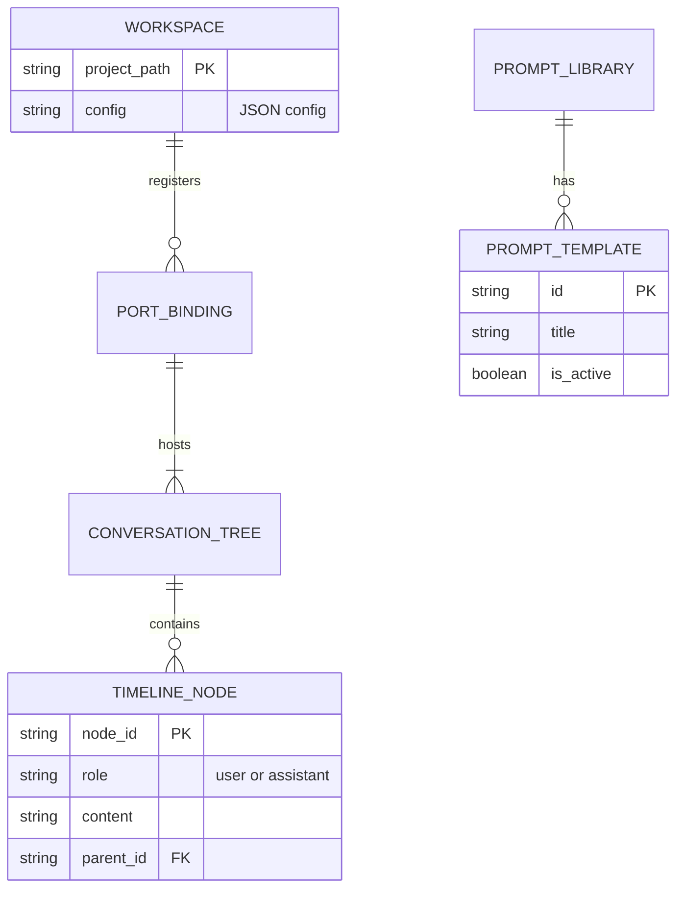
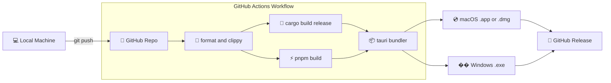

# iterate - Technical Architecture Whitepaper (6 Layers of Modern Development)

> **Architect's Note:** This whitepaper reverse-engineers the `iterate` (cunzhi) project codebase into a cohesive mental model. It serves as your definitive map for navigating, modifying, and scaling the system confidently.

---

## 1. Tech Stack & Language Strategy (The Foundation)

### Analysis: "Tauri-driven MCP Microservice" Flavor
Based on `Cargo.toml` and `package.json`, this is a high-performance, system-level desktop application mixed with a web-based presentation layer.
- **Rust (Tokio, Axum, RMCP):** Chosen for zero-cost abstractions, absolute memory safety, and raw performance. It serves as the indestructible backbone for handling stdio pipes, IPC, and concurrent HTTP requests without crashing IDEs.
- **Vue 3 + Vite + TypeScript:** Chosen for rapid UI iteration and reactivity. It allows building complex, stateful chat interfaces (Timelines, Markdown rendering) much faster than native Rust UI frameworks.
- **UnoCSS + Naive UI:** Provides a lightweight, highly customizable atomic CSS engine and pre-built components, keeping the frontend bundle small and responsive.

**Why this combination?** 
The AI IDE ecosystem (Windsurf/Cursor) communicates via standard input/output (stdio). If the IDE freezes, the developer experience is ruined. Rust ensures the `mcp-server` is invisible and blazing fast, while Tauri + Vue provides a beautiful, cross-platform "escape hatch" for the user to interact with the AI.

---

## 2. Framework & App Lifecycle (The Engine)

### Analysis: Dual-Binary Architecture
Unlike standard web apps, this system uses a **Dual-Binary Lifecycle**:
1. `mcp-server` (Headless): Booted by the IDE. It only speaks JSON-RPC over stdio.
2. `iterate` (Daemon/GUI): Booted independently or awakened by `mcp-server`. It runs an Axum HTTP server to listen for requests and renders the Tauri Vue frontend.

### Visual: High-Level Architectural Diagram

---

## 3. Data Model & Relationships (The Memory)

### Analysis: Ephemeral + Persistent State
The system doesn't use a heavy relational database like PostgreSQL. Instead, it relies on high-speed memory structures (`ConversationManager`) and file-based persistence (`~/.cunzhi/`, `~/.cunzhi_ports/`).

### Visual: Entity-Relationship (ER) Diagram

**Insight (Bottlenecks):**
If the Timeline scales to 10,000+ nodes, passing the entire tree via WebSockets/IPC to the Vue frontend will cause serialization bottlenecks and UI lag. The recent introduction of `strip_heavy_metadata` and incremental updates (snapshot/delta) prevents this exact issue.

---

## 4. System Architecture & Patterns (The Blueprint)

### Analysis: "Port and Adapters" (Hexagonal) Architecture
Look at `src/rust/` and `src/bin/`:
- **Protocol Layer:** `mcp-server.rs` acts purely as an adapter for Anthropic's MCP protocol.
- **Transport Layer:** `server/mod.rs` (HTTP/WebSocket) routes external triggers into the core.
- **Application Core:** `conversation/`, `config/`. This is where the pure business logic lives.
- **Presentation Layer:** `src/frontend/`. Purely reactive views.

**Mental Model for Navigation:**
When tracing a bug or adding a feature:
1. **Did the AI fail to trigger it?** Look at `mcp-server.rs` or `Prompt Rules`.
2. **Did the message not reach the UI?** Look at `server/mod.rs` (HTTP POST) or `bridge/ws.rs` (WebSockets).
3. **Is the UI rendering it wrong?** Look at `src/frontend/components/`.

---

## 5. Workflow & Scalability (The Growth)

### Analysis: Strict & Typed
With Rust's borrow checker and Vue's TypeScript strictness, the development environment is highly constrained. This prevents runtime crashes, which is critical for a daemon process running in the background.

**Scenario: Adding a "Team Feature" (Cloud Sync)**
If you wanted to sync conversation histories across team members:
1. **Backend (`src/rust/conversation/`):** Add a sync module that listens to `TimelineNode` creation and pushes deltas to Appwrite/Supabase.
2. **Protocol (`src/rust/bridge/ws.rs`):** Add a WebSocket event `sync_status_changed`.
3. **Frontend (`src/frontend/components/`):** Add a "Cloud Sync" indicator in the Nav bar reacting to the WS event.

---

## 6. Deployment & Infrastructure (The World)

### Analysis: Local-First Desktop App
This is not a Vercel-hosted SaaS. It is a local-first application built into native binaries (`.app` for macOS). It uses GitHub Actions for continuous integration and cross-platform compilation.

### Visual: Deployment Pipeline Diagram

