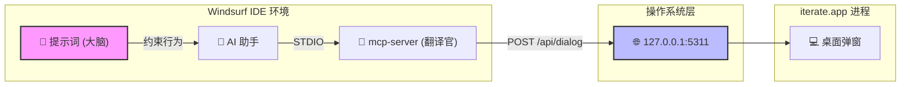
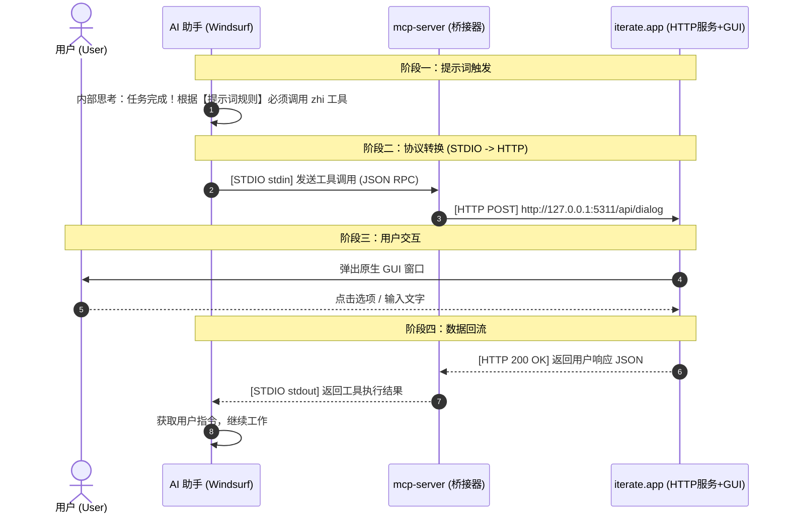
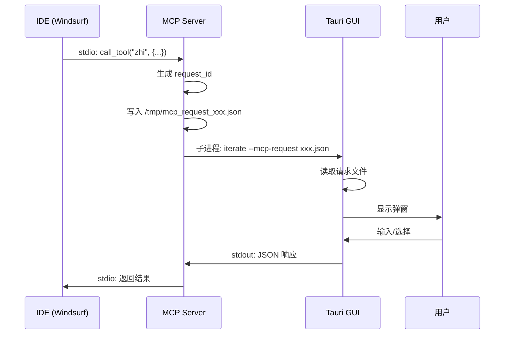
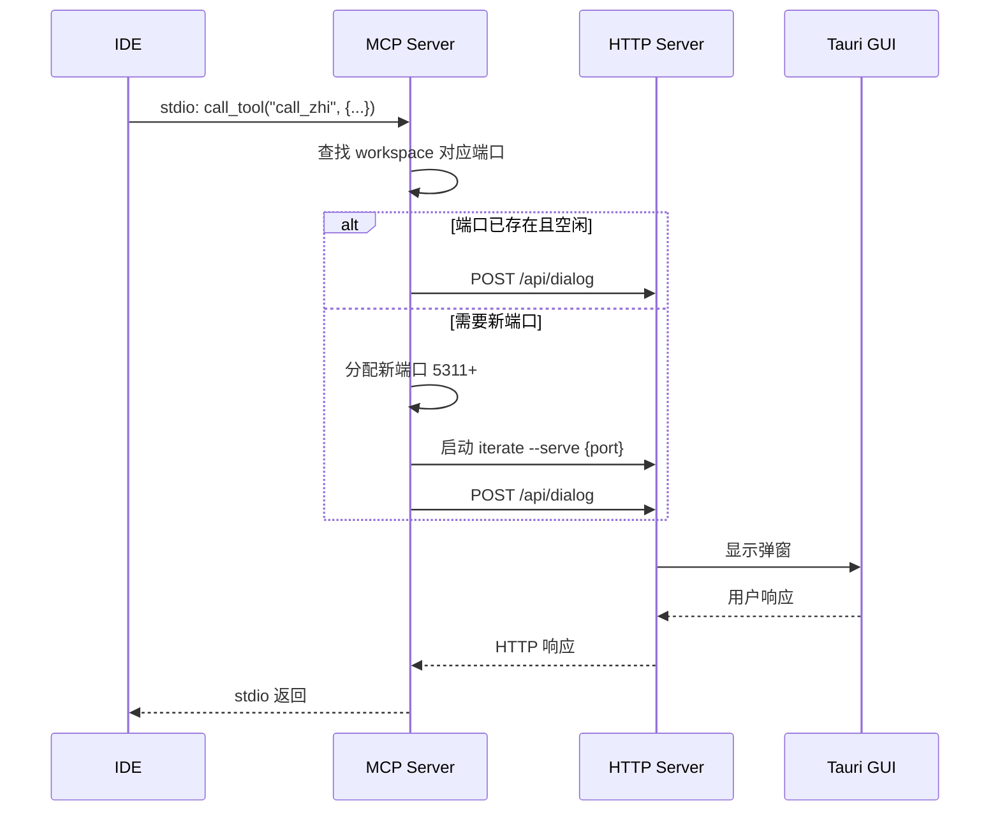

# iterate MCP 技术架构白皮书

> 版本: 1.0 | 日期: 2026-03-04 | 作者: AI 辅助生成

---

## 1. 执行摘要

iterate 是一个 AI 对话拦截器，通过 MCP (Model Context Protocol) 让 AI 助手（如 Windsurf、Cursor）能够与用户进行交互式对话。本文档详细分析 iterate 的 MCP 架构实现原理。

### 核心发现

项目中存在**两套 MCP 架构**：

| 架构 | 位置 | 通信方式 | 端口 | 适用场景 |
|------|------|----------|------|----------|
| **轻量架构** | `ios-bridge-dev/` | stdio + 子进程 | 无 | 单 IDE、简单场景 |
| **多实例架构** | 主仓库 `src/` | stdio + HTTP | 5311-5399 | 多 IDE、多项目 |

---

## 2. 技术栈分析

### 2.1 核心技术

| 层级 | 技术 | 用途 |
|------|------|------|
| **后端** | Rust 2021 + Tokio | 异步运行时、MCP 服务器 |
| **MCP 协议** | rmcp crate | MCP 协议实现 |
| **桌面 GUI** | Tauri 2.x | 跨平台桌面应用 |
| **前端** | Vue 3 + TypeScript | 弹窗 UI |
| **移动端** | SwiftUI (iOS) | 手机端通知 |

### 2.2 依赖关系

```
rmcp (MCP 协议库)
  ↓
ZhiServer (MCP 服务器实现)
  ↓
InteractionTool / MemoryTool / ... (工具实现)
  ↓
Tauri GUI 或 HTTP Server
```

---

## 3. 最小核心调用原理 (多维理论拆解)

本节从六个维度（视觉、语言、代数、数值、计算、历史）深度拆解 iterate 当前基于 **“HTTP 服务化 + 提示词驱动”** 的最小可用核心（MVP）架构。

### 3.1 视觉视角 (Visuals)

**最小核心组件拓扑图（展示物理形态）：**


**三步调用序列图（展示时间与数据流动）：**


### 3.2 语言学视角 (Linguistic)

将整个系统拟人化：
- **提示词（AI Prompts）** 是贴在黑客（AI）屏幕上的**“员工守则”**：“干完活必须给我打电话汇报，不准自己瞎编！”
- **mcp-server** 是装在小黑屋墙上的**“电话线转接头”**（因为 AI 只能插墙上的 STDIO 数据口）。
- **iterate.app** 就是用户手里的**“智能手机”**（自带 HTTP 信号基站和屏幕）。
- **过程**：黑客看了一眼守则决定联系用户 -> 连上转接头 -> 拨通手机号码（`127.0.0.1:5311`） -> 手机屏幕亮起 -> 用户点击“继续” -> 黑客收到信号继续工作。

### 3.3 代数学视角 (Algebra)

将系统抽象为三个关键函数的复合：
- $T(State) 
ightarrow Boolean$：**提示词触发函数**（条件判断）
- $B(x) 
ightarrow HTTP_{req}$：**Bridge桥接函数**（mcp-server的 stdio 转 HTTP）
- $G(HTTP_{req}) 
ightarrow HTTP_{res}$：**GUI服务函数**（iterate.app 处理请求并返回）

系统运行的数学表达式：
$$ Action = \begin{cases} B^{-1}( G( B(Context) ) ), & \text{if } T(State) = True \\ Continue, & \text{if } T(State) = False \end{cases} $$
*解析：只有当提示词条件 $T$ 满足时，上下文才会经过桥接 $B$ 进入 GUI $G$，完成后再通过 $B^{-1}$（HTTP转回stdio）反向求值，交还给 AI。*

### 3.4 数值视角 (Numerical)

系统性能与参数的量化切片：
- **触发延迟**：从 IDE 写入 stdin 到 mcp-server 发起 HTTP 请求，耗时 `< 1ms`。
- **网络开销**：`127.0.0.1` 环回地址的 TCP 握手和 HTTP POST 延迟在 **`1~3ms`** 级别，等同于 IPC。
- **寻址坐标**：固定的 **`5311`** 端口（默认），确保请求精准打到 Iterate 守护进程。
- **内存占用**：`mcp-server` 常驻内存仅约 **`5~10MB`**，而 `iterate.app` 承担渲染，内存约在 `80~150MB`。

### 3.5 计算学视角 (Computation)

`mcp-server` 的本质是一个 **STDIO-to-HTTP 的反向代理（Reverse Proxy）**。核心算法极其简单且同步阻塞：
```rust
// mcp-server.rs 核心伪代码
async fn handle_ai_call(args: Json) -> Result<String> {
    let payload = json!({ "message": args.message, "workspace": args.project_path });
    // 阻塞式的 HTTP POST 请求，挂起等待用户在 GUI 操作完成
    let http_response = reqwest::Client::new()
        .post("http://127.0.0.1:5311/api/dialog")
        .json(&payload).send().await?;
    // 将 HTTP 返回的结果直接透传到 Stdout
    return Ok(http_response.text().await?);
}
```

### 3.6 历史视角 (History)

架构演进的终极形态：
1. **第一代（脚本+文件）**：AI 写 `output.md`，执行 shell 脚本。缺点：极度依赖环境，shell 易被杀。
2. **第二代（MCP+子进程）**：写 `/tmp/`，拉起新 `iterate` 进程。缺点：冷启动慢，无法全局管理会话。
3. **第三代（MCP+常驻 HTTP）**：即当前的最小核心，GUI 成为常驻系统的守护进程（Daemon）。优势：极速响应（0冷启动）、中心化管理并发对话、彻底跨平台解耦。**提示词（Prompt）**正式被纳为架构的一部分，形成“能力(MCP) + 意图(Prompt)”的完整闭环。

---

## 4. 架构一：轻量架构 (ios-bridge-dev)

### 4.1 架构图

```
┌─────────────────────────────────────────────────────────────────┐
│                         IDE (Windsurf/Cursor)                    │
└─────────────────────────────────────────────────────────────────┘
                              │ stdio
                              ▼
┌─────────────────────────────────────────────────────────────────┐
│                    MCP Server (mcp-server 二进制)                │
│  ┌─────────────────────────────────────────────────────────────┐│
│  │ ZhiServer::call_tool("zhi")                                 ││
│  │   → InteractionTool::zhi()                                  ││
│  │   → create_tauri_popup()                                    ││
│  └─────────────────────────────────────────────────────────────┘│
└─────────────────────────────────────────────────────────────────┘
                              │ 子进程调用
                              │ iterate --mcp-request /tmp/xxx.json
                              ▼
┌─────────────────────────────────────────────────────────────────┐
│                      Tauri GUI 进程                              │
│  ┌─────────────────┐    ┌─────────────────┐                     │
│  │ Rust 后端       │◄──►│ Vue 前端        │                     │
│  │ - get_cli_args  │    │ - useMcpHandler │                     │
│  │ - read_mcp_req  │    │ - McpPopup.vue  │                     │
│  │ - send_mcp_resp │    │                 │                     │
│  └─────────────────┘    └─────────────────┘                     │
└─────────────────────────────────────────────────────────────────┘
                              │ stdout (JSON)
                              ▼
                    返回给 MCP Server → IDE
```

### 4.2 调用链路

1. **IDE 发起请求**：通过 stdio 调用 MCP 工具 `zhi`
2. **MCP Server 处理**：`ZhiServer::call_tool("zhi")` 解析参数
3. **生成请求文件**：`create_tauri_popup()` 将请求写入 `/tmp/mcp_request_<uuid>.json`
4. **启动 GUI 子进程**：执行 `iterate --mcp-request <file>`
5. **GUI 读取请求**：前端通过 `get_cli_args` + `read_mcp_request` 获取请求
6. **用户交互**：弹窗显示，用户输入/选择
7. **返回响应**：`send_mcp_response` 将 JSON 输出到 stdout
8. **MCP Server 收集**：父进程读取子进程 stdout，解析响应
9. **返回 IDE**：MCP 协议格式返回给 AI

### 4.3 关键代码

**MCP Server 入口** (`src/rust/bin/mcp_server.rs`):
```rust
#[tokio::main]
async fn main() -> Result<(), Box<dyn std::error::Error>> {
    auto_init_logger()?;
    log_important!(info, "启动 MCP 服务器");
    run_server().await
}
```

**服务器实现** (`src/rust/mcp/server.rs`):
```rust
pub async fn run_server() -> Result<(), Box<dyn std::error::Error>> {
    let service = ZhiServer::new()
        .serve(stdio())  // 使用 stdio 传输
        .await?;
    service.waiting().await
}
```

**弹窗创建** (`src/rust/mcp/handlers/popup.rs`):
```rust
pub fn create_tauri_popup(request: &PopupRequest) -> Result<String> {
    // 写入临时请求文件
    let temp_file = temp_dir.join(format!("mcp_request_{}.json", request.id));
    fs::write(&temp_file, request_json)?;
    
    // 调用 iterate 命令
    let output = Command::new(&command_path)
        .arg("--mcp-request")
        .arg(temp_file.to_string_lossy().to_string())
        .output()?;
    
    // 返回 stdout 内容
    Ok(String::from_utf8_lossy(&output.stdout).to_string())
}
```

### 4.4 特点

- ✅ **简单**：无需端口管理，无网络通信
- ✅ **隔离**：每次请求独立进程，天然隔离
- ❌ **性能**：每次请求都启动新进程
- ❌ **多路复用**：不支持多个请求共享一个 GUI 实例

---

## 5. 架构二：多实例架构 (主仓库)

### 5.1 架构图

```
┌─────────────────────────────────────────────────────────────────┐
│                    多个 IDE 实例                                 │
│  ┌─────────────┐  ┌─────────────┐  ┌─────────────┐              │
│  │ Windsurf    │  │ Cursor      │  │ VS Code     │              │
│  └─────────────┘  └─────────────┘  └─────────────┘              │
└─────────────────────────────────────────────────────────────────┘
         │ stdio          │ stdio          │ stdio
         ▼                ▼                ▼
┌─────────────────────────────────────────────────────────────────┐
│                    MCP Server (mcp-server)                       │
│  ┌─────────────────────────────────────────────────────────────┐│
│  │ 端口分配逻辑                                                 ││
│  │ - 扫描 5311-5399                                            ││
│  │ - 检查 /health 和 /status                                   ││
│  │ - 注册到 ~/.cunzhi_ports/<port>                             ││
│  │ - 使用 .alloc.lock 防并发                                   ││
│  └─────────────────────────────────────────────────────────────┘│
└─────────────────────────────────────────────────────────────────┘
         │                │                │
         │ HTTP POST /api/dialog           │
         ▼                ▼                ▼
┌─────────────────────────────────────────────────────────────────┐
│              iterate HTTP Server (iterate --serve)               │
│  ┌─────────────┐  ┌─────────────┐  ┌─────────────┐              │
│  │ :5311       │  │ :5312       │  │ :5313       │              │
│  │ workspace A │  │ workspace B │  │ workspace C │              │
│  └─────────────┘  └─────────────┘  └─────────────┘              │
│                                                                  │
│  HTTP 端点:                                                      │
│  - GET  /health   → 健康检查                                    │
│  - GET  /status   → 状态查询 (is_busy)                          │
│  - POST /api/dialog → 弹窗请求                                  │
└─────────────────────────────────────────────────────────────────┘
         │                │                │
         ▼                ▼                ▼
┌─────────────────────────────────────────────────────────────────┐
│                      Tauri GUI 窗口                              │
│  - 多窗口管理                                                    │
│  - request_id 路由                                               │
│  - project_path 隔离                                             │
│  - 会话树 (ConversationManager)                                  │
└─────────────────────────────────────────────────────────────────┘
```

### 5.2 端口分配机制

```
┌─────────────────────────────────────────────────────────────────┐
│                      端口分配流程                                │
└─────────────────────────────────────────────────────────────────┘

1. 扫描已注册端口
   ~/.cunzhi_ports/
   ├── 5311  (内容: /Users/example/project-a)
   ├── 5312  (内容: /Users/example/project-b)
   └── .alloc.lock

2. 检查端口状态
   GET http://127.0.0.1:{port}/health → 是否是 iterate?
   GET http://127.0.0.1:{port}/status → 是否空闲?

3. 分配逻辑
   - 已有 workspace 对应端口且空闲 → 复用
   - 无对应端口 → 从 5311 开始找空闲端口
   - 启动新实例 → iterate --serve {port}
   - 注册 → 写入 ~/.cunzhi_ports/{port}
```

### 5.3 关键代码

**端口扫描** (`src/bin/mcp-server.rs`):
```rust
async fn scan_registered_ports() -> Vec<u16> {
    let port_dir = dirs::home_dir()?.join(".cunzhi_ports");
    let mut ports = vec![];
    for entry in std::fs::read_dir(&port_dir)? {
        if let Ok(port) = name.parse::<u16>() {
            ports.push(port);
        }
    }
    ports
}

async fn find_free_port() -> u16 {
    for port in 5311..5400 {
        if !check_port_running(port).await {
            return port;
        }
    }
    5311 // fallback
}
```

**HTTP 请求** (`src/bin/mcp-server.rs`):
```rust
async fn call_dialog(port: u16, request: &DialogRequest) -> Result<String> {
    let url = format!("http://127.0.0.1:{}/api/dialog", port);
    let response = reqwest::Client::new()
        .post(&url)
        .json(request)
        .send()
        .await?;
    Ok(response.text().await?)
}
```

### 5.4 特点

- ✅ **多 IDE 支持**：每个 workspace 独立端口
- ✅ **性能**：复用已启动的 GUI 实例
- ✅ **隔离**：workspace + request_id 双重隔离
- ❌ **复杂**：需要端口管理、锁机制
- ❌ **依赖**：需要 HTTP server 持续运行

---

## 6. 数据模型

### 6.1 请求结构

```rust
pub struct ZhiRequest {
    pub message: String,           // 显示给用户的消息
    pub predefined_options: Vec<String>, // 预定义选项
    pub is_markdown: bool,         // 是否 Markdown
    pub project_path: Option<String>, // 项目路径
}

pub struct PopupRequest {
    pub id: String,                // 请求 UUID
    pub message: String,
    pub predefined_options: Option<Vec<String>>,
    pub is_markdown: bool,
    pub project_path: Option<String>,
    pub link_url: Option<String>,
    pub link_title: Option<String>,
    pub browser_ai_response: Option<String>,
}
```

### 6.2 响应结构

```rust
pub struct McpResponse {
    pub user_input: Option<String>,      // 用户输入文本
    pub selected_options: Vec<String>,   // 选中的选项
    pub images: Vec<ImageData>,          // 附加图片
    pub files: Vec<String>,              // 附加文件
    pub keep_going: bool,                // 是否继续对话
}
```

---

## 7. 工具清单

### 7.1 核心工具

| 工具名 | 功能 | 触发词 |
|--------|------|--------|
| `zhi` | 弹窗交互 | zhi |
| `ji` | 记忆管理 | ji |
| `xi` | 经验查找 | xi |
| `ci` | 提示词库 | ci |
| `pai` | 子代理派发 | pai |
| `sou` | 代码搜索 | sou |

### 7.2 工具授权机制

```rust
/// 需要 zhi 前置确认的工具
const TOOLS_REQUIRING_ZHI: &[&str] = &["ji", "pai"];

/// zhi 授权有效期
const ZHI_AUTH_TIMEOUT_SECS: u64 = 300; // 5 分钟
```

危险操作（如 `ji` 写入、`pai` 派发）需要先调用 `zhi` 获取用户确认，授权有效期 5 分钟。

---

## 8. 多 IDE 隔离机制

### 8.1 轻量架构隔离

```
进程级隔离：
IDE A → MCP Server A → GUI 进程 A (PID 1234)
IDE B → MCP Server B → GUI 进程 B (PID 5678)

每个请求独立进程，天然隔离
```

### 8.2 多实例架构隔离

```
端口级隔离：
IDE A (workspace: /project-a) → :5311
IDE B (workspace: /project-b) → :5312
IDE C (workspace: /project-a) → :5311 (复用)

请求级隔离：
request_id: uuid-1234 → 响应路由到正确窗口
project_path: /project-a → 会话树隔离
```

---

## 9. 部署架构

### 9.1 文件结构

```
/Applications/iterate.app/          ← Tauri 桌面应用
    Contents/MacOS/iterate          ← 主二进制
    
~/.cunzhi_ports/                    ← 端口注册目录
    5311                            ← workspace 路径
    5312
    .alloc.lock                     ← 分配锁

~/.cunzhi/                          ← 运行时数据
    {port}/
        output.md                   ← AI 输出
        input.md                    ← 用户输入

~/.cunzhi-knowledge/                ← 知识库
    patterns.md
    problems.md
    regressions.md
    conversations/
```

### 9.2 MCP 配置

**Windsurf** (`~/.codeium/windsurf/mcp_config.json`):
```json
{
  "mcpServers": {
    "iterate": {
      "command": "/Applications/iterate.app/Contents/MacOS/mcp-server",
      "args": []
    }
  }
}
```

---

## 10. 安全性考虑

### 10.1 权限控制

- **工具级授权**：危险工具需要 `zhi` 前置确认
- **超时机制**：授权 5 分钟后过期
- **项目隔离**：不同项目数据不互通

### 10.2 数据安全

- **本地存储**：所有数据存储在本地
- **临时文件**：请求文件用后即删
- **无网络依赖**：轻量架构完全离线

---

## 11. 性能优化建议

### 11.1 当前瓶颈

1. **轻量架构**：每次请求启动新进程，冷启动慢
2. **多实例架构**：端口扫描有延迟

### 11.2 优化方向

1. **进程池**：预启动 GUI 进程池
2. **长连接**：使用 WebSocket 替代 HTTP
3. **缓存**：缓存端口状态，减少 /health 检查

---

## 12. 未来演进路线

### Phase 1: 统一架构
- 合并 `ios-bridge-dev` 和主仓库代码
- 统一为多实例架构

### Phase 2: 性能优化
- 实现进程池
- WebSocket 长连接

### Phase 3: 云端同步
- 会话历史云端同步
- 多设备协同

---

## 附录 A: Mermaid 图表源码

### A.1 轻量架构时序图



### A.2 多实例架构时序图



---

## 附录 B: 相关文件索引

| 文件 | 用途 |
|------|------|
| `ios-bridge-dev/src/rust/bin/mcp_server.rs` | 轻量架构入口 |
| `ios-bridge-dev/src/rust/mcp/server.rs` | MCP 服务器实现 |
| `ios-bridge-dev/src/rust/mcp/handlers/popup.rs` | 弹窗创建 |
| `ios-bridge-dev/src/rust/mcp/tools/interaction/mcp.rs` | zhi 工具 |
| `src/bin/mcp-server.rs` | 多实例架构入口 |
| `src/rust/server/mod.rs` | HTTP 服务器 |
| `MCP_SERVER.md` | 安装文档 |
| `docs/mcp-tools-flow.md` | 工具流程文档 |

---

*最后更新: 2026-03-04*
